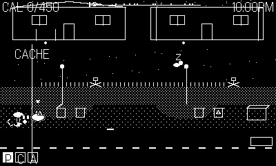

# Bin Night

*A tag-team trash heist for Playdate.* One street. One night. Three mouths to feed.



Collection night in the suburbs. The garbage truck arrives at dawn and eats
the street bin by bin — everything still in a bin when the claw closes is
gone. **Trash Panda** (pries, tips, hauls the heavy stuff), **Bin Chicken**
(flies over fences, plunges that absurd beak into closed bins) and **Alley
Cat** (sprints, pounces, squeezes anywhere) must bank the calorie QUOTA in
their alley cache before the street is empty. Miss it and the gang goes
hungry.

## Controls

| Input | Action |
| --- | --- |
| D-pad | Move |
| A | Context action: rummage / flip lid / beak-plunge / grab / drop |
| A (hold) | Cat sprint / Chicken flight |
| B | Special: Panda bin-tip / Chicken SQUAWK decoy / Cat pounce |
| B (hold) | Swap character |
| Crank | Panda pries latched bins (mind the slips) |

## The tag team

Every character is a verb the others lack — Panda opens, Chicken crosses,
Cat runs. Parked characters keep working: the panda drags his heavy prize
home, the chicken piles loot out of an open bin, the cat guards against
rats and the possum. Loot handled by two or more characters banks at
**TEAMWORK x1.5** — crack it, ferry it, sprint it home.

## The night

Noise wakes houses: porch light on, homeowner out, carried loot
confiscated (stand perfectly still in the light to stay unseen). Chained
dogs lunge at the fence line and chase cats from twice as far. Sprinklers
soak loot (-25%) and cats refuse to cross. Rats drag drops into the storm
drains; the possum climbs a tree with your best piece. Night cars flatten
the careless. At dawn, loot the very bin the claw is reaching for at
**DAREDEVIL x1.5** — and somewhere on every street waits THE LASAGNA.

Street 1 (Quiet Crescent) is handcrafted; every street after is generated
meaner: more latches, more dogs, more sprinklers, bigger quota.

## Building

```
make            # release build -> out/BinNight.pdx
make smoke      # instrumented build (autopilot + heartbeat datastore)
tools/smoke.sh  # headless simulator verification
```
